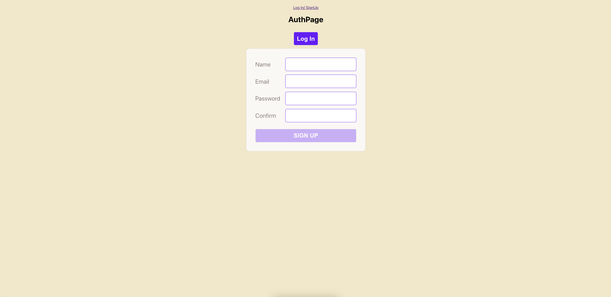
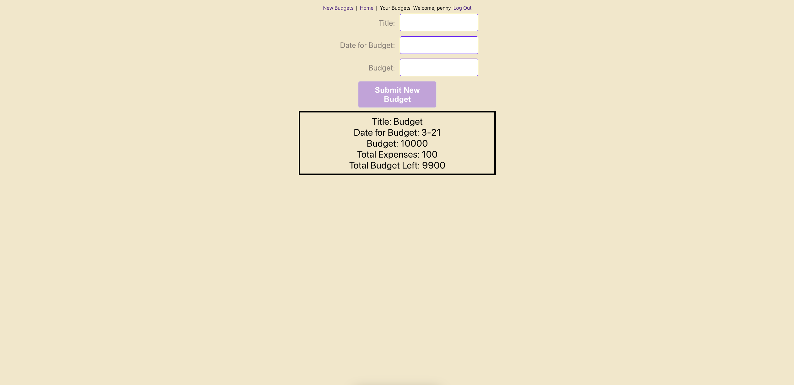
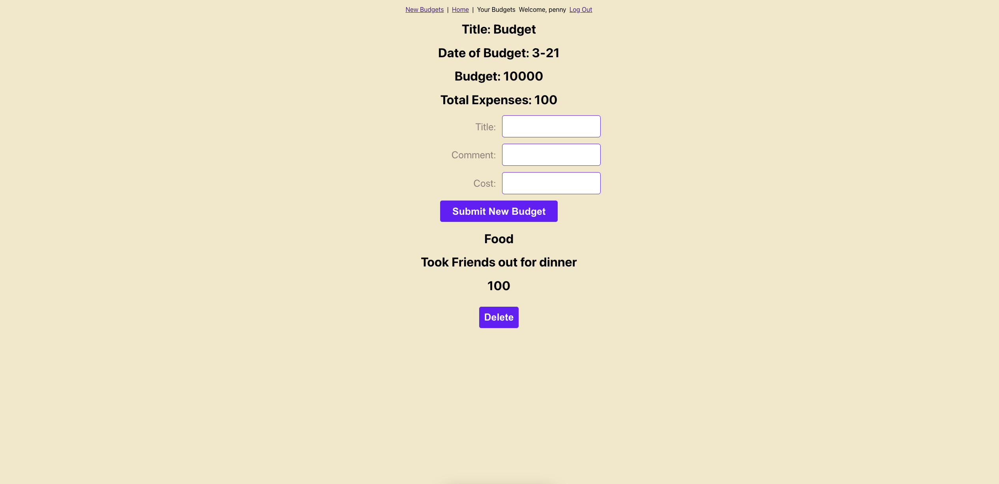

# Penny Protector
Penny Protector is a budget building app that allows you to add expenses. Caliculate the remaining of the budget using all the expenses you have added.

# Screen Shots
|   Description | Screenshot | 
|:-------------:|:-------------:|
| SignUp Form | |
| Budget Display and Create | |
| Budget Display and Create | |

# Technologies Used

# Getting Started With Penny Protector

# Next Steps and Future Additions